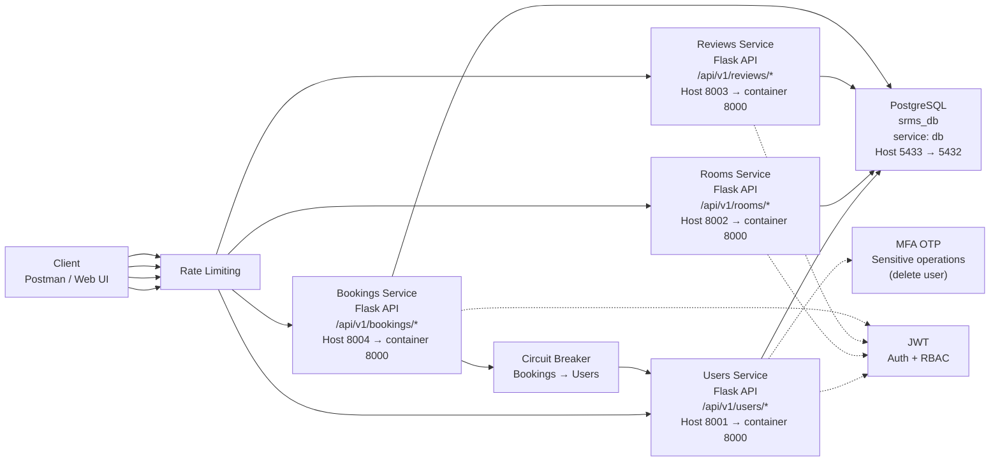
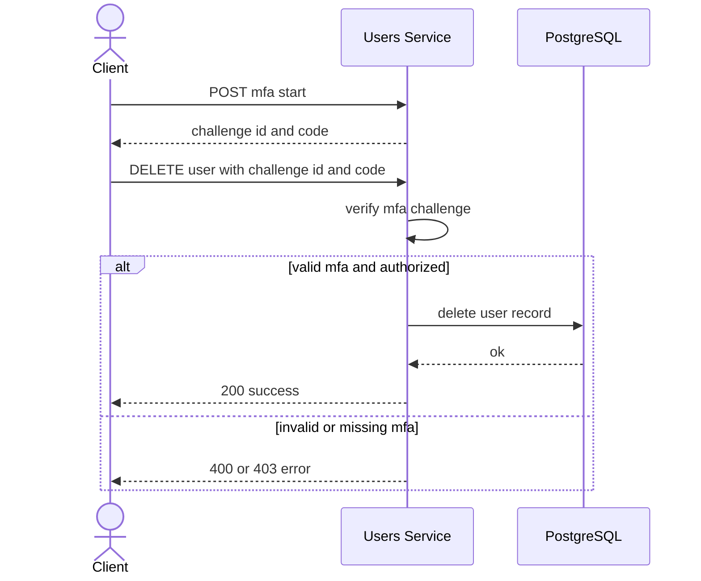

# SRMS Diagrams (Full Microservices Architecture + MFA Flow)

---

## 1) Microservices Architecture (Users + Rooms + Reviews + Bookings + DB)

```mermaid
graph LR
  C["Client<br/>Postman / Web UI"]

  U["Users Service<br/>Flask API<br/>/api/v1/users/*<br/>Host 8001 → container 8000"]
  R["Rooms Service<br/>Flask API<br/>/api/v1/rooms/*<br/>Host 8002 → container 8000"]
  RV["Reviews Service<br/>Flask API<br/>/api/v1/reviews/*<br/>Host 8003 → container 8000"]
  B["Bookings Service<br/>Flask API<br/>/api/v1/bookings/*<br/>Host 8004 → container 8000"]

  DB["PostgreSQL<br/>srms_db<br/>service: db<br/>Host 5433 → 5432"]

  RL["Rate Limiting"]
  CB1["Circuit Breaker<br/>Bookings → Users"]

  JWT["JWT<br/>Auth + RBAC"]
  MFA["MFA OTP<br/>Sensitive operations<br/>(delete user)"]

  C --> RL --> U
  C --> RL --> R
  C --> RL --> RV
  C --> RL --> B

  U --> DB
  R --> DB
  RV --> DB
  B --> DB

  B --> CB1 --> U

  U -.-> JWT
  R -.-> JWT
  RV -.-> JWT
  B -.-> JWT
  U -.-> MFA

```

## 2) MFA flow

```mermaid
sequenceDiagram
  actor C as Client
  participant U as Users Service
  participant DB as PostgreSQL

  C->>U: POST mfa start
  U-->>C: challenge id and code

  C->>U: DELETE user with challenge id and code
  U->>U: verify mfa challenge

  alt valid mfa and authorized
    U->>DB: delete user record
    DB-->>U: ok
    U-->>C: 200 success
  else invalid or missing mfa
    U-->>C: 400 or 403 error
  end

```